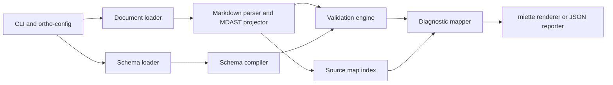

# MDAST schema validation CLI design

## Document status

- Status: Proposed
- Date: 2026-03-07
- Target audience: Implementing engineers

## Overview

`mdast-check` is a Rust command-line interface (CLI) tool that validates the
Markdown Abstract Syntax Tree (MDAST) for a Markdown document against a JSON
Schema document. The tool must report validation failures in a way that is
useful to authors editing the original Markdown source, not only to engineers
reading serialized tree data.

The primary user journey is:

1. Read a Markdown document from a file or standard input.
2. Parse the Markdown into MDAST using the `markdown` crate.
3. Serialize the MDAST into a JSON value suitable for schema validation.
4. Validate that JSON value against a JSON Schema using
   `json-schema-validator-core`.
5. Re-map validation failures back onto Markdown source spans where possible.
6. Print friendly diagnostics using `miette`, with stable machine-readable exit
   codes and optional JSON output for automation.

The stretch goal is a Markdown-native schema authoring mode where schema
documents are written as Markdown annotated with
[Markdoc tag syntax](https://markdoc.dev/docs/syntax) and compiled into the
same internal JSON Schema representation.

## Related references

The following repository documents should be treated as implementation
references alongside this design:

- [OrthoConfig user's guide](./ortho-config-users-guide.md) for layered CLI,
  environment, and configuration-file loading behaviour.
- [`rstest-bdd` user's guide](./rstest-bdd-users-guide.md) for feature-file
  layout, fixture injection, and end-to-end behavioural test structure.

## Goals

- Validate MDAST documents against user-provided JSON Schema documents.
- Report schema validation failures with source excerpts from the original
  Markdown file.
- Provide deterministic CLI behaviour suitable for local use, Continuous
  Integration (CI), and editor integration.
- Keep schema validation and diagnostic mapping separate so the validation core
  remains testable without terminal concerns.
- Support snapshot-friendly output for both human-readable and machine-readable
  modes.
- Establish a design that can grow into Markdown-native schemata without
  reworking the core validation pipeline.

## Non-goals

- Markdown content linting independent of a schema contract.
- Automatic schema inference from Markdown documents.
- Live editor protocol integration in the first release.
- Support for every future Markdown extension before it is required by an
  explicit schema use case.
- Automatic fixing of invalid Markdown documents.

## Design drivers

- Diagnostics must refer back to the Markdown source, not only to JSON
  Pointer-like locations within the serialized MDAST.
- The first release must use `markdown` for parsing and
  `json-schema-validator-core` for schema validation.
- Testing must combine unit tests, snapshot tests, and Behaviour-Driven
  Development (BDD) scenarios using `rstest` and `rstest-bdd`.
- Configuration and CLI parsing must use `ortho-config` v0.8.0 so the tool can
  evolve without inventing a parallel configuration model. Follow the layering
  and composition guidance in
  [OrthoConfig user's guide](./ortho-config-users-guide.md).
- Large fixture documents should live in `.fixture` files and be loaded with
  `include_str!` to keep tests legible and diffable.
- Friendly errors are a product requirement, not cosmetic polish.

## User-facing contract

### Command surface

The initial CLI should expose a single validation command through the root
invocation:

```plaintext
mdast-check validate --document docs/example.md --schema schema/article.json
```

The root command may also treat `validate` as the default subcommand later, but
the first release should keep the explicit verb for clarity.

### Proposed flags

| Flag | Purpose |
| --- | --- |
| `--document <PATH>` | Path to the Markdown document. Use `-` to read from standard input. |
| `--schema <PATH>` | Path to the JSON Schema document. |
| `--schema-format <FORMAT>` | Force schema parsing mode. Supported values: `json` and `markdoc`. Defaults by file extension. |
| `--config <PATH>` | Optional `ortho-config` file. |
| `--format <OUTPUT>` | Diagnostic output format. Supported values: `human` and `json`. |
| `--fail-fast` | Stop after the first validation failure that can be rendered. |
| `--max-errors <N>` | Cap reported validation failures while keeping exit status non-zero. |
| `--quiet` | Suppress success output. |

_Table 1: Proposed initial `mdast-check` CLI flags._

### Exit codes

Use stable process exit codes so CI can distinguish failures:

- `0`: validation succeeded
- `1`: validation failed because the Markdown document does not satisfy the
  schema
- `2`: invalid invocation or configuration
- `3`: schema document is invalid or unsupported
- `4`: Markdown parsing failed
- `5`: unexpected internal failure

## Architecture overview

The implementation should be split into six modules with narrow
responsibilities.

For screen readers: The following flowchart shows the document, schema,
validation, and diagnostic pipeline.



_Figure 1: Proposed validation pipeline for `mdast-check`._

### Module boundaries

| Module        | Responsibility                                                                                     |
| ------------- | -------------------------------------------------------------------------------------------------- |
| `cli`         | Parse arguments, load `ortho-config`, choose output format, map errors to exit codes.              |
| `document`    | Read Markdown input, preserve path identity, normalize line endings for diagnostics.               |
| `schema`      | Load JSON Schema or Markdoc-native schema documents and produce an internal compiled schema input. |
| `mdast_model` | Parse Markdown, serialize MDAST into `serde_json::Value`, and record source positions.             |
| `validate`    | Call `json-schema-validator-core`, collect failures, normalize error paths.                        |
| `diagnostics` | Map validation failures onto Markdown spans and render `miette` reports or JSON output.            |

_Table 2: Proposed module responsibilities._

## Data model and source mapping

### Why source mapping is explicit

Schema validators typically report violations against a logical JSON instance,
for example a JSON Pointer such as `/children/0/type`. That is necessary but
insufficient for authors working in Markdown. `mdast-check` therefore needs a
secondary index that maps serialized MDAST paths back to the original Markdown
source locations.

### Proposed internal structures

The implementation should introduce the following core types:

```rust
pub struct ParsedDocument {
    pub source_name: SourceName,
    pub markdown: String,
    pub mdast_json: serde_json::Value,
    pub source_index: SourceIndex,
}

pub struct SourceIndex {
    pub by_instance_path: BTreeMap<InstancePath, MarkdownSpan>,
}

pub struct MarkdownSpan {
    pub offset: usize,
    pub length: usize,
    pub line: usize,
    pub column: usize,
}
```

The exact type names may differ, but the separation should remain:

- the parsed document owns the original Markdown text,
- the validation engine sees serialized JSON plus a path index,
- the diagnostic renderer receives structured spans rather than reparsing the
  Markdown source.

### Path indexing strategy

When converting MDAST nodes into `serde_json::Value`, the serializer should
also emit stable instance paths into `SourceIndex`. Each node or field that may
produce a validation error should register the narrowest sensible span:

- node-level violations map to the full source range for the node,
- scalar property violations map to the token or text range that sourced the
  property when available,
- synthesized properties with no direct source range fall back to the nearest
  owning node span,
- document-level failures fall back to the file span.

This index should use the same logical path format that the validator returns.
If `json-schema-validator-core` returns a different path representation, add a
small adapter layer rather than leaking validator-specific path logic into the
diagnostic renderer.

## Markdown parsing and MDAST projection

### Parsing requirements

Use `markdown::to_mdast()` to parse the Markdown input into the crate’s MDAST
representation. Configure parse options explicitly rather than relying on
defaults hidden inside helper functions, so feature support is versioned in one
place.

The first implementation should support CommonMark plus the specific extensions
required by target schemata. Avoid enabling every extension up front, because
the schema surface becomes harder to reason about when nodes appear only under
rare parsing modes.

### JSON projection requirements

The MDAST must be converted into a JSON value that is intentionally designed
for schema validation:

- preserve node `type` values exactly,
- preserve arrays such as `children` in source order,
- serialize optional properties only when present,
- serialize positional metadata only if schemata need to match on it,
- exclude redundant data that would make the schema brittle without serving a
  user-visible need.

The first release should treat the projected JSON shape as an internal
contract. It should be documented in tests and snapshots, but not yet promised
as a public stable API. That gives room to adjust the projection if
`json-schema-validator-core` or `markdown` force a refinement.

## Schema handling

### JSON Schema mode

The baseline mode accepts a schema document written in JSON. The loader should:

1. Read the schema file into a string.
2. Parse it into `serde_json::Value`.
3. Validate the schema itself using `json-schema-validator-core`.
4. Compile or prepare the schema for repeated document validation.

Schema self-validation errors must be treated separately from document
validation errors. They should use `miette` diagnostics against the schema file
path when the failure has a schema location.

### Schema configuration

`ortho-config` v0.8.0 should own configuration loading for:

- default schema path,
- default output format,
- parser feature flags,
- diagnostic behaviour such as `fail_fast` and `max_errors`,
- future schema registry aliases.

The first release should keep precedence conventional:

1. CLI flags
2. environment variables, if exposed through `ortho-config`
3. configuration file
4. built-in defaults

The implementation should follow the same layered precedence model and prefer
derived configuration helpers such as composition and merge layers where they
keep tests deterministic. See
[OrthoConfig user's guide](./ortho-config-users-guide.md).

### Stretch goal: Markdoc-native schema mode

The Markdown-native schema mode should compile a constrained subset of Markdoc
syntax into the same internal JSON Schema representation used by JSON files.
This keeps validation and diagnostics agnostic to how the schema was authored.

The first useful subset is:

- headings define schema sections or named definitions,
- fenced JSON blocks hold literal keyword payloads where raw JSON is still the
  least ambiguous notation,
- `` tags introduce schema nodes,
- `` tags describe object properties,
- `` style tags model scalar keywords,
- `` compiles to `$ref`.

This mode should be explicitly labelled experimental. It is a stretch goal
because two mappings must both remain readable:

- Markdown authoring syntax to internal schema nodes,
- compiled schema nodes back to author-facing schema diagnostics.

## Validation pipeline

### Validation stages

Validation should run in four ordered stages:

1. CLI and configuration validation.
2. Schema loading and schema self-validation.
3. Markdown parsing and MDAST projection.
4. Document validation against the compiled schema.

Stopping early is correct for stages 1 through 3. For stage 4, the default
behaviour should collect multiple validation failures so the user can fix
several issues in one pass. `--fail-fast` overrides that default.

### Error normalization

Wrap validator failures into a crate-local error model before rendering them.
That model should capture:

- the instance path within the projected MDAST,
- the schema path or keyword, when available,
- a human-oriented summary,
- any machine-readable validator code,
- whether the failure has an exact Markdown source span, a parent span, or only
  a document-level fallback.

This keeps `miette` and JSON output stable even if the upstream validator
changes its raw error type layout.

## Diagnostics design

### Error categories

Use `thiserror` for structured domain errors and `miette` for rendered
diagnostics. The top-level categories should be:

- `CliUsageError`
- `ConfigLoadError`
- `SchemaLoadError`
- `SchemaValidationError`
- `MarkdownParseError`
- `DocumentValidationError`
- `InternalInvariantError`

`DocumentValidationError` should aggregate one or more normalized validation
failures while still rendering as a coherent report.

### Friendly message requirements

Friendly messages should answer three questions:

1. What part of the Markdown document is invalid?
2. What rule did the schema require?
3. What concrete change is likely to resolve the failure?

An example human-readable diagnostic shape is:

```plaintext
error: heading node does not satisfy schema
  --> docs/article.md:12:1
   |
12 | ## Release notes
   | ^^^^^^^^^^^^^^^^ expected depth <= 1 for top-level heading
   |
   = schema path: /properties/children/items/anyOf/1/properties/depth/maximum
   = instance path: /children/3/depth
```

The summary line should be authored by `mdast-check`, not copied verbatim from
the validator, so wording remains consistent and oriented towards Markdown
authors.

### JSON output mode

The machine-readable mode should emit a stable JSON envelope:

```json
{
  "document": "docs/article.md",
  "schema": "schema/article.json",
  "valid": false,
  "errors": [
    {
      "message": "heading depth exceeds schema maximum",
      "instance_path": "/children/3/depth",
      "schema_path": "/properties/children/items/anyOf/1/properties/depth/maximum",
      "line": 12,
      "column": 1,
      "length": 16
    }
  ]
}
```

This format should be snapshot-tested and treated as a compatibility contract
once released.

## Testing strategy

### Unit tests

Use `rstest` for parser, projection, schema, and diagnostic mapping tests.
Focus unit tests on narrow contracts:

- MDAST node projection into JSON shape,
- instance path registration in `SourceIndex`,
- validator error normalization,
- message wording and fallback span selection,
- configuration precedence using `ortho-config`.

### BDD tests

Use `rstest-bdd` to describe end-to-end validation behaviour in `.feature`
files. These tests should cover scenarios such as:

- validating a conforming document,
- reporting multiple failures from one document,
- mapping a nested node failure back to the correct source line,
- distinguishing invalid schema input from invalid Markdown input,
- validating Markdoc-native schemata in experimental mode.

Feature layout, fixture wiring, and step-definition behaviour should follow the
documented `rstest-bdd` patterns for feature files, `#[scenario]` bindings,
and fixture injection. See
[`rstest-bdd` user's guide](./rstest-bdd-users-guide.md).

### Snapshot tests

Use `insta` and `assert-cmd` for output snapshots:

- command success and failure output,
- JSON output envelopes,
- `miette` human-readable reports,
- compiled Markdoc schema snapshots for the stretch goal.

### Fixture strategy

Large Markdown documents, schema documents, and feature inputs should live in
fixture files with extensions such as `.md.fixture`, `.json.fixture`, and
`.feature`. Load them using `include_str!` so tests remain deterministic and do
not rely on runtime filesystem state.

Suggested layout:

```plaintext
tests/
  fixtures/
    markdown/
      valid-article.md.fixture
      invalid-heading-depth.md.fixture
    schema/
      article-schema.json.fixture
      invalid-schema.json.fixture
    markdoc/
      article-schema.md.fixture
  features/
    validate_document.feature
```

## Observability and debugging

The first release does not need full tracing infrastructure, but it should
support predictable debugging:

- `RUST_LOG`-controlled debug logs around schema loading and validation stages,
- optional `--format json` output for editor or CI tooling,
- snapshot-friendly deterministic ordering of reported errors,
- no colour or terminal-width dependency in snapshot tests unless explicitly
  normalized.

## Risks and mitigations

| Risk                                                            | Why it matters                                                     | Mitigation                                                                                         |
| --------------------------------------------------------------- | ------------------------------------------------------------------ | -------------------------------------------------------------------------------------------------- |
| Validator paths do not align cleanly with projected JSON paths. | Diagnostics could point to the wrong Markdown span.                | Introduce a normalization layer and test it with nested-node fixtures.                             |
| MDAST projection exposes too much parser metadata.              | Schema authoring becomes brittle and difficult to read.            | Keep the projected shape intentionally small and add metadata only when a schema needs it.         |
| Markdoc-native schema syntax becomes too magical.               | Authors may not understand what schema is actually being enforced. | Keep the first subset explicit, compile to JSON Schema snapshots, and document the generated form. |
| Friendly diagnostics drift from validator semantics.            | Messages may become inaccurate or misleading.                      | Preserve schema path and instance path in every normalized failure and snapshot-test wording.      |

_Table 3: Initial implementation risks and mitigations._

## Implementation plan summary

The recommended implementation order is:

1. establish the CLI and configuration shell,
2. parse Markdown and project MDAST plus source paths,
3. integrate schema validation and normalized error mapping,
4. render friendly diagnostics with snapshot coverage,
5. add experimental Markdoc schema compilation on top of the existing core.

This order keeps the highest-risk technical seam, source-aware diagnostic
mapping, visible early while preventing the Markdoc stretch goal from blocking
the baseline deliverable.
